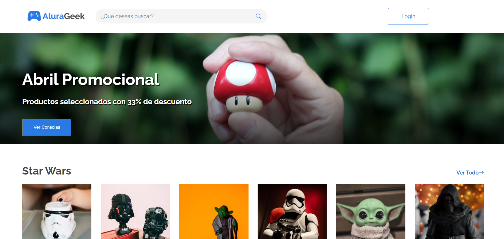

# **`Ecommerce Alura Geek`** 
# **`Challenge del programa ONE`**
## **`Nahuel-DevOne, Front-end Developer`**

# *Información del proyecto:*

Este es un ecommerce, que desarrollé para el challenge del [Programa ONE](https://www.oracle.com/ar/education/oracle-next-education/) de Oracle + Alura LATAM, que forma parte de la formación Front-end.  
Consiste en la maquetación del figma dado, y la implementación de diversas funciones propias del ecommerce, como un buscador, un login, validación de formulario, envio del formulario, agregar o sacar productos, entre otras, con JavaScript.
El ecommerce sigue en desarrollo, falta agregar maquetación y funcionalidades.

## *Version 1.0.0:*

- 

<!-- - Se usa como base de datos Firestore -->

## *Desarrollado con:*

- [Visual Studio Code](https://code.visualstudio.com/)
- [HMTL](https://developer.mozilla.org/es/docs/Web/HTML)
- [CSS](https://developer.mozilla.org/es/docs/Web/CSS)
- [JavaScript](https://developer.mozilla.org/es/docs/Web/JavaScript)
- [Bootstrap-icons](https://icons.getbootstrap.com/)

<!-- # *Sobre el flujo de compra:*

-  -->

**Screenshots:**

### 1. Home:
## 

<!-- ### 2. Detalle del producto seleccionado:

## 

### 3. Carrito de compras, con productos seleccionados:

## 

### 4. Carrito de compras, con productos y formulario completo:

## 
### 5. Fin de la compra y mensaje al usuario:

## 

### 6. Si no hay productos en el carrito:

##  -->

#### *¡Thanks a lot for reading me!* _Yours sincerely_... "**DevOne**".

  <!-- Contador de forks -->
  [![Forks][forks-shield]][forks-url]

  <!-- MARKDOWN LINKS & IMAGES -->
  <!-- https://www.markdownguide.org/basic-syntax/#reference-style-links -->
  [forks-shield]: https://img.shields.io/github/forks/nahuel-devone/ReadMeTemplate?style=for-the-badge
  [forks-url]: https://github.com/nahuel-devone/alura-geek/ReadMeTemplate/network/members

